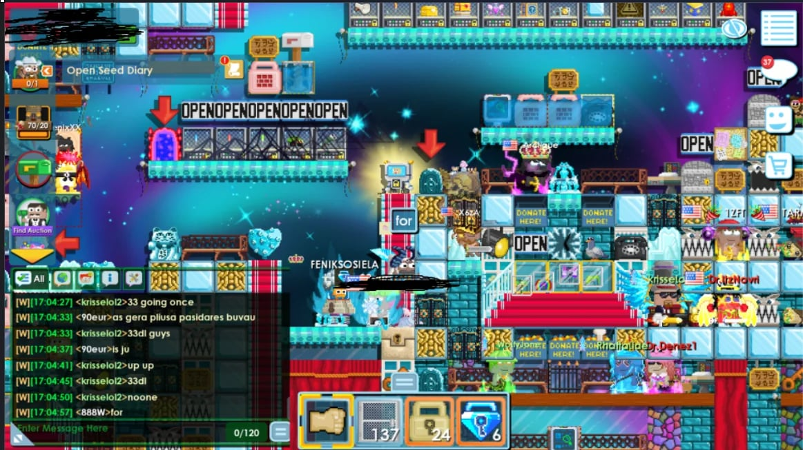

# Growtopia Chat Skin — Black/Green Terminal Theme

A custom chat UI reskin for Growtopia PC client. Dark black background with green terminal-style text (#00ff41), newest messages at the bottom, always visible chat.

## Preview



- Black semi-transparent chat background
- Green `#00ff41` text (Matrix/terminal style)
- Filter tabs inside the chat box
- Input field at the bottom
- Newest messages shown at bottom, auto-scrolls
- Chat always visible (no flickering on world change)
- Persistent size — does not reset on world change

## Installation

1. Close Growtopia completely
2. Navigate to:
   ```
   C:\Users\YourName\AppData\Local\Growtopia\GameData\UI\Windows\Console\
   ```
3. **Back up** the original files (`Console.rcss` and `Console.rml`)
4. Copy `Console.rcss` and `Console.rml` from this repo into that folder
5. Launch Growtopia

## Uninstall

Delete the two files and verify the originals from your backup are in place.  
Alternatively, Growtopia will re-download the original files from the server if you delete them.

## Notes

- Tested on Growtopia PC v5.48
- These are client-side visual files only — no gameplay advantage, no account data
- If the game updates and the chat breaks, re-apply the files
